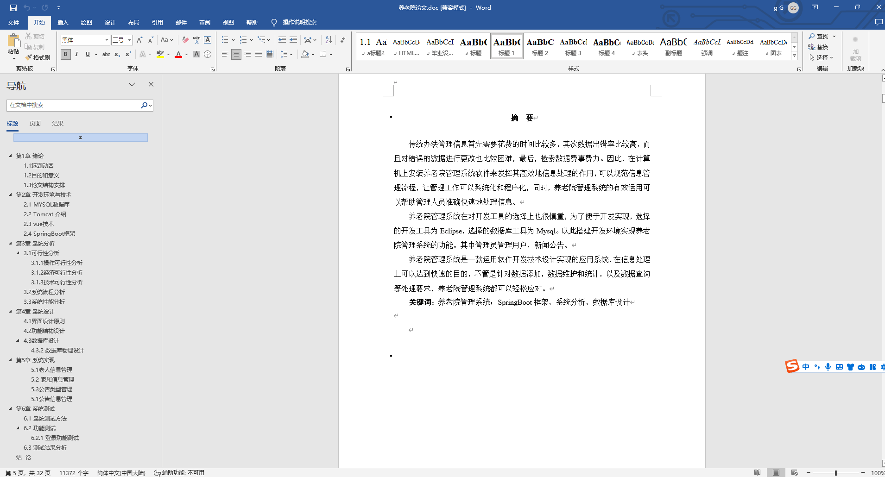

## 272.基于Spring Boot的养老院管理系统(程序+报告)

###  获取sql数据库文件: 从戎源码网 (https://armycodes.com/) QQ: 386869957 QQ群: 377586148
###  所有系统地址: (https://github.com/YuLin-Coder/AllProjectCatalog) 
###  所有项目以及源代码本人均调试运行无问题 可支持远程安装部署调试、定制修改、代码讲解

## 项目介绍
基于Spring Boot框架实现的养老院管理系统，系统包含三种角色：管理员、老人、家属,主要功能如下。

### 【管理员】:
- 个人中心: 管理员可以查看和编辑个人信息。
- 管理员管理: 管理员可以对其他管理员进行管理。
- 用户管理: 管理员可以对家属和老人进行管理。
- 家厘意见管理: 管理员可以查看和回复家属意见和反馈。
- 寝室信息管理: 管理员可以管理养老院内寝室的信息。
- 安全信息管理: 管理员可以管理养老院内的安全信息。
- 饮食信息管理: 管理员可以管理老人的饮食信息。
- 体检管理：管理员可以记录和管理老人的体检信息。
- 药物管理：管理员可以管理老人的药物信息。
- 需求袋管理：管理员可以管理老人的需求袋信息。
- 出入信息管理：管理员可以记录和管理老人的出入信息
- 公告信息管理：管理员可以发布和管理养老院的公告信息。
- 基础数据管理：管理员可以管理系统的基础数据。

### 【家属】:
- 个人中心：家属可以查看和编辑个人信息。
- 老人管理：家属可以管理自己关联的老人信息。
- 家厘意见管理：家属可以提交意见和建议。
- 寝室信息管理：家属可以查看和管理老人所在寝室的信息。
- 安全信息管理：家属可以查看和管理老人的安全信息。
- 饮食信息管理：家属可以查看和管理老人的饮食信息。
- 体检管理：家属可以查看和记录老人的体检信息。
- 出入信息管理：家属可以记录和查看老人的出入信息。

### 【老人】:
- 个人中心：老人可以查看和编辑个人信息。
- 寝室信息管理：老人可以查看和管理自己所在寝室的信息。
- 安全信息管理：老人可以查看和管理自己的安全信息。
- 饮食信息管理：老人可以查看和管理自己的饮食信息。
- 体检管理：老人可以查看和记录自己的体检信息。
- 药物管理：老人可以查看和管理自己的药物信息。
- 需求袋管理：老人可以提交自己的需求和请求。
- 出入信息管理：老人可以记录和查看自己的出入信息。
- 公告信息管理：老人可以查看和阅读养老院发布的公告信息。

## 项目技术
- 编程语言：Java
- 数据库：MySQL
- 项目管理工具：Maven
- 前端技术：VUE
- 后端技术：Spring、SpringMVC、MyBatis

## 运行环境
- JDK版本：JDK1.8及以上
- 开发工具：IDEA、Ecplise、Myecplise都可以
- 数据库: MySQL5.7及以上
- Maven：maven3.0及以上
- Node：14.14.0及以上

## 运行截图

